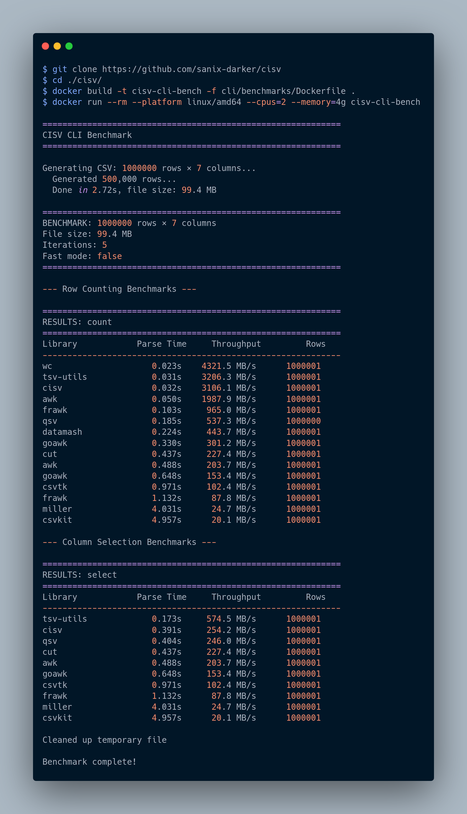

# cisv-cli


CLI distribution for CISV.

## FEATURES

- Fast CSV parsing/counting from shell
- Column selection and ranged reads
- Benchmark mode and writer subcommand
- Same parser core as `cisv-core`
- Ships a man page (`man cisv`)

## INSTALLATION

### FROM PACKAGE MANAGERS

#### APT (DEBIAN/UBUNTU)

```bash
TAG="$(curl -fsSL https://api.github.com/repos/Sanix-Darker/cisv-cli/releases/latest | python3 -c 'import json,sys; print(json.load(sys.stdin)[\"tag_name\"])')"
VER="${TAG#v}"
curl -fLO "https://github.com/Sanix-Darker/cisv-cli/releases/download/${TAG}/cisv-cli_${VER}_amd64.deb"
sudo apt-get update
sudo apt-get install -y "./cisv-cli_${VER}_amd64.deb"
```

#### DNF/YUM/ZYPPER (RPM-BASED)

```bash
TAG="$(curl -fsSL https://api.github.com/repos/Sanix-Darker/cisv-cli/releases/latest | python3 -c 'import json,sys; print(json.load(sys.stdin)[\"tag_name\"])')"
VER="${TAG#v}"
curl -fLO "https://github.com/Sanix-Darker/cisv-cli/releases/download/${TAG}/cisv-cli-${VER}-1.x86_64.rpm"
sudo dnf install -y "./cisv-cli-${VER}-1.x86_64.rpm"
# or: sudo yum install -y "./cisv-cli-${VER}-1.x86_64.rpm"
# or: sudo zypper install -y "./cisv-cli-${VER}-1.x86_64.rpm"
```

#### APK (ALPINE) FROM RELEASE ARTIFACT

```bash
TAG="$(curl -fsSL https://api.github.com/repos/Sanix-Darker/cisv-cli/releases/latest | python3 -c 'import json,sys; print(json.load(sys.stdin)[\"tag_name\"])')"
VER="${TAG#v}"
wget "https://github.com/Sanix-Darker/cisv-cli/releases/download/${TAG}/cisv-cli-${VER}-r1.x86_64.apk"
sudo apk add --allow-untrusted "./cisv-cli-${VER}-r1.x86_64.apk"
```

### FROM SOURCE

```bash
git clone --recurse-submodules https://github.com/Sanix-Darker/cisv-cli
cd cisv-cli
make all
sudo make install
man cisv
```

## CORE DEPENDENCY (SUBMODULE)

This repository tracks `cisv-core` via the `./core` git submodule.

To fetch the latest `cisv-core` (main branch) in your local clone:

```bash
git submodule update --init --remote --recursive
```

CI and release workflows also run this update command, so new `cisv-core` releases are pulled automatically during builds.

## CLI USAGE

```bash
cisv [OPTIONS] FILE
```

Key options:

- `-c, --count`: count rows only
- `-s, --select`: select columns by index
- `--from-line`, `--to-line`: parse range
- `-d, --delimiter`: custom delimiter
- `-t, --trim`: trim whitespace
- `--select-name`: select columns by header names
- `--where`: filter rows (e.g. `status==ok`, `latency>100`, `name~john`)
- `--no-header`: skip first row in output
- `--quiet`: suppress non-data stderr logs
- `--strict`: explicit strict parse mode (default)
- `--json`, `--jsonl`: machine-readable output

## EXAMPLES

### BASIC

```bash
./cli/build/cisv examples/sample.csv
./cli/build/cisv -c examples/sample.csv
cat examples/sample.csv | ./cli/build/cisv -
cat examples/sample.csv | ./cli/build/cisv --no-header -
./cli/build/cisv --select-name a,c examples/sample.csv
./cli/build/cisv --where 'a==1' examples/sample.csv
./cli/build/cisv --json examples/sample.csv
```

### DETAILED

```bash
./cli/build/cisv -s 0,2 examples/sample.csv
./cli/build/cisv --from-line 2 --to-line 3 examples/sample.csv
```

More runnable scripts: [`examples/`](./examples)

## BENCHMARKS

```bash
docker build -t cisv-cli-bench -f cli/benchmarks/Dockerfile .
docker run --rm --platform linux/amd64 --cpus=2 --memory=4g cisv-cli-bench
```



## RELEASE PACKAGING

On each `v*` tag, the release workflow now:

- builds and tests `cisv-cli`
- produces `tar.gz`, `.deb`, `.rpm`, and `.apk` artifacts
- publishes artifacts to GitHub Releases
- optionally publishes `.deb`/`.rpm` into Packagecloud repos for `apt` and `rpm` package managers

Required release secrets for Packagecloud publication:

- `PACKAGECLOUD_TOKEN`
- `PACKAGECLOUD_REPO` (value: `sanix-darker/cisv-cli`)

## UPSTREAM CORE

- cisv-core: https://github.com/Sanix-Darker/cisv-core
